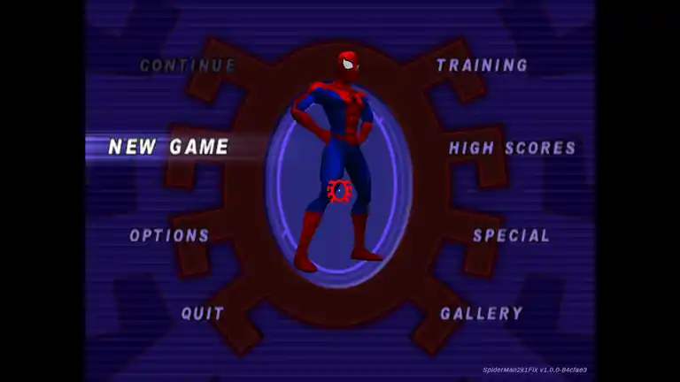
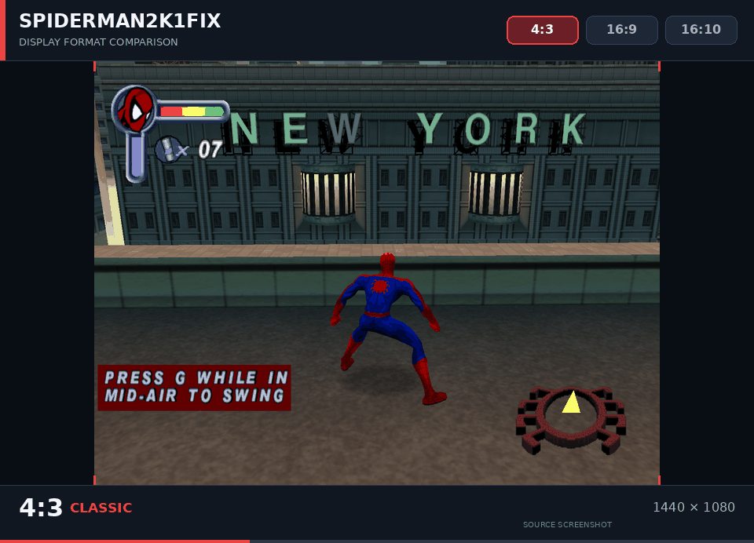

# SpiderMan2k1Fix

**Version 2.0.0 — released November 14, 2026:** Download the [official standalone SpiderMan2k1Fix.exe](https://github.com/legluondunet/SpiderMan2k1Fix/releases/download/v2.0.0/SpiderMan2k1Fix.exe) or view the [v2.0.0 release and notes](https://github.com/legluondunet/SpiderMan2k1Fix/releases/tag/v2.0.0). SDL3 gamepads, Save Game confirmation, centered 4:3 SAVE GAME / INPUT NAME screens, widescreen HUD and stable Alt+Tab were tested on Windows 11 and Wine/GE-Proton. See also the [technical release notes](RELEASE_NOTES_2.0.0.md) and [RC2 validation history](docs/references/RELEASE_2_0_RC_TEST_PLAN.md).

[](https://github.com/legluondunet/SpiderMan2k1Fix/actions/workflows/spiderman2k1fix-standalone-windows-x86.yml)
[](#installation-on-windows-and-linux-wine)

SpiderMan2k1Fix is an **unofficial fan-made patch** for the PC version of *Spider-Man*, released by Activision in 2001. It improves compatibility with modern Windows systems and Linux/Wine while adding new features.

**Development:** `main` has unified `game/fix.dll` ([PR #162](https://github.com/legluondunet/SpiderMan2k1Fix/pull/162)), not yet released. This page documents v2.0.0; see the [unified build guide](docs/unified/README.md).

## Screenshots

<table>
  <tr>
    <td width="50%" align="center">
      <a href="assets/screenshots/main-menu.webp">
        
      </a>
      <br>
      <sub><b>Main menu</b> — original 4:3 presentation</sub>
    </td>
    <td width="50%" align="center">
      <a href="assets/screenshots/aspect-ratio-comparison.gif">
        
      </a>
      <br>
      <sub><b>Aspect ratio comparison</b> — 4:3, 16:9 and 16:10</sub>
    </td>
  </tr>
</table>

## Main Features

- **No-CD:** Bypasses the original CD-ROM check through an in-memory patch, without modifying the game executable.
- **Modern display support:** Runs in borderless fullscreen at the monitor's native resolution, with automatic widescreen 3D (`Auto`) or a centered classic 4:3 mode. Also supports multi-monitor configurations.
- **Automatic FOV adjustment:** Automatically adjusts the field of view to match the desktop resolution and aspect ratio, providing proper widescreen rendering without distorting the 3D scene.
- **Aspect ratio corrections:** Original 4:3 menus, videos, comics and 2D elements. **SAVE GAME**, **INPUT NAME**, **SAVE COMPLETED** and frozen **PAUSED** backgrounds/titles retain 4:3 automatically on the verified executable ([PR #144](https://github.com/legluondunet/SpiderMan2k1Fix/pull/144)).
- **Widescreen HUD:** Corrects the proportions and positioning of HUD elements, including health and web gauges, compass, mission objectives, boss health bars, and in-game pause menus, with native scene-entry iris. Tested at 1920×1080 (16:9) and 1920×1200 (16:10).
- **FPS limiter:** Configurable frame-rate cap, set to **30 FPS by default**. Lower limits, such as 20 FPS, can be selected for timing-sensitive gameplay.
- **Alt+Tab stability:** Background game pause, synchronized Bink/DirectSound, and keyboard/gamepad resume. Press and release any key or an eligible selected controller button after returning. The OS desktop cursor is restored. See [focus details](docs/references/CONFIGURATION.md).
- **SDL3 gamepads:** A sole mapped controller activates automatically after its controls return to neutral. With multiple pads, the first **deliberate button or stick input** selects the active pad; another can take over when the current pad is released. No Start selection. DS4, Xbox 360 and PS3 have been tested under Wine/Proton; DS4/Xbox 360 also on Windows 11. [Details](docs/references/RELEASE_2_0_RC_TEST_PLAN.md).
- **Keyboard layouts:** Automatically detects the active keyboard layout and adapts the game's controls, keyboard labels, and cheat-code entry. The original game only supported QWERTY layouts.
- **No game mouse:** Keyboard/gamepad only. Game cursor, clicks and polling are permanently off. Desktop pointer unaffected; legacy `MouseEnabled` ignored.
- **DPI awareness:** Handles Windows display scaling to ensure correct window dimensions and rendering on high-DPI displays.
- **Settings preservation:** Keyboard, audio, and brightness settings are managed through `SpiderMan2k1Fix.ini`; SDL3 controller mappings are stored separately per model, with automatic recovery of invalid settings and a single rolling `.ini.old` backup. The original `Spidey.cfg` file is no longer needed.
- **PNG screenshots:** Press **F9** to save lossless screenshots (`scrnNNNN.png`) under `SpiderMan2k1Fix/screenshots/` (per-user fallback when the game folder is read-only).
- **Debug logging:** With `[Debug] Log=1`, `SpiderMan2k1Fix.log` automatically includes a one-shot `SYS-INFO` configuration report: OS/Win32 version, detected Wine and Proton hints, Linux kernel as reported by Wine, CPU and core counts, RAM, GPU and D3D9 driver metadata, display resolution/count/refresh, available Linux desktop session hints, plus XInput/DirectInput gamepads. No extra log option is needed.
- **Build identification:** Displays the patch version and source commit in the game's main menu and diagnostic logs.
- **Original taskbar icon:** Restores the game's original icon in the Windows taskbar.

Successfully tested on Windows 11 and Linux/Wine.

**First-time Xbox setup:** no controller INI edit is needed for a normally recognized Xbox 360 gamepad. Release all controls when the game starts. With one connected mapped controller it activates automatically. With multiple pads, press a gameplay/menu button or intentionally move the left stick after a neutral frame to choose the active pad; only one pad can control the game at a time. You may still customize the per-model profile. The original game's joystick bytes remain preserved in `[Internal] RawHex`, but legacy `[Joystick]` INI bindings no longer affect SDL3.

## Bugs Resolved

- **Alt+Tab crashes and input loss:** Combined Windows 11 hardware tests passed 20/20 checks, including six actual gated repairs of the original stuck Left Alt with the built-in, signature-guarded Left Alt latch recovery. Under Wine, absent or delayed background PAUSED is tolerated only if return works normally.
- **Focus-loss instability:** Added automatic game pausing with synchronized video and audio playback, preventing gameplay and media synchronization issues while the game is in the background.
- **Crash on exit:** Fixed a crash that could occur when quitting the game.
- **Broken F9 screenshots on Windows:** Fixed screenshots that appeared entirely purple or contained no visible game graphics.
- **Audio crackling:** Fixed truncated WAV loading by restoring missing final sectors through the game's native PKR reader while preserving DirectSound playback.
- **Unsupported display modes:** Prevented the game from switching to obsolete fullscreen resolutions and 16-bit display modes that could produce a black screen on modern monitors.
- **Hidden desktop cursor:** Fixed cases where the Windows mouse pointer remained invisible after switching away from the game.

The native Wine/X11 Alt+Tab helper is included as an optional backend. See [technical plan](docs/references/WINE_X11_FOCUS_AUTOSTART.md).

## Known Issues in the Original Game

The following issues are inherited from the original game and remain unresolved:

- **FPS-dependent gameplay:** Certain bosses and levels may not work correctly at 30 FPS. Set `FPSLimit=20` in the INI file when needed.

## Known Issues Under Investigation

- **Open investigations (causes unconfirmed):** NEW YORK W lightning ([#146](https://github.com/legluondunet/SpiderMan2k1Fix/issues/146)), moving shadows ([#147](https://github.com/legluondunet/SpiderMan2k1Fix/issues/147)), and bank window impact audio timing ([#145](https://github.com/legluondunet/SpiderMan2k1Fix/issues/145)).
- **Scene-dependent focus pause under Wine/Proton:** The custom background PAUSED screen can appear immediately in menus, be deferred until a cinematic transition, or appear late/not at all in 3D. This remains a tolerated limitation **only when** switching back retains working controls, graphics and sound without crashes. Windows 11 native focus pause passed the combined hardware tests.

## Frequently Asked Questions

### Why is there no mouse cursor inside the game?

**Intentionally disabled.** Use the keyboard or a supported controller; the old `MouseEnabled=0/1` key cannot re-enable the original mouse. Do not duplicate this INI key.

If the **Windows/Linux desktop cursor** disappears **after Alt+Tab**, that is a different fault. Enable `[Debug] Log=1`, note your OS/Wine version and attach the complete log.

### How do I enable Steam Deck controls in Desktop Mode?

Steam Deck support is being investigated **after the v2.0.0 release**. In Desktop Mode, keep Steam running; hold **☰** (~3 seconds) to switch the Desktop/Gamepad layout, release all controls once; use any gameplay button or left stick if several controllers are connected.

On the tested Deck, **Steam library → game → … → keyboard icon** enabled text input without focus loss, but the overlay obscured fields and omitted **F9**. Direct Lutris launch lacked this in-game keyboard. Test observations and follow-up plans: [Steam Deck issue #120](https://github.com/legluondunet/SpiderMan2k1Fix/issues/120).

### Why is there no sound?

First distinguish **total silence** from missing **music, movie audio, or effects**, and whether it occurs before or after Alt+Tab. Check the selected system output, system/app/game volume, supported executable, paired DLL versions and whether the INI passed validation.

The game uses its original **DirectSound** engine. The built-in WAV/PKR correction fixes truncated/crackling effects, **not every cause of silence**. Do not enable unrelated experimental audio switches. If unresolved, reproduce with `[Debug] Log=1`, then report the full log and your Windows or Wine/Proton environment. See [troubleshooting details](docs/references/CONFIGURATION.md).

## Built-in native WAV audio correction

The default fix repairs verified truncated WAV data in original PKR resources, using CRC-checked bytes and retaining native DirectSound. No INI option is required. First released in **v1.1.0**, it passed Wine listening tests; Windows 11 focus recovery restored **37/37** DirectSound voices in reported tests (not a guarantee for all hardware).

Diagnostic switches and implementation: [technical audio guide](docs/references/diagnostics/audio/PKR_NATIVE_AUDIO_REPAIR.md).

## Installation on Windows and Linux (Wine)

**v2.0.0 (released):** Download **one standalone**
`SpiderMan2k1Fix.exe` with the WinMM proxy, fix DLL, SDL3 x86 runtime/license
and optional Linux X11 helper embedded. Authentic original-ISO installation,
eight-file SHA-256 verification, gameplay and clean launcher exit were observed
under **Wine-staging 11.17 and native Windows 11**. The release candidate
also passed executable ISO/CUE failure, game-integrity and rollback tests
under Windows CI before publication.

1. Download the [published v2.0.0 launcher](https://github.com/legluondunet/SpiderMan2k1Fix/releases/download/v2.0.0/SpiderMan2k1Fix.exe). Place it beside **one legally owned original**
   `.iso` or `.cue` (keep the `.bin`/`.img` track referenced by the CUE).
2. Run `SpiderMan2k1Fix.exe` (Windows) or `wine SpiderMan2k1Fix.exe` (Linux). **Released v2.0.0** installs game data in `SpiderMan2k1Fix/`.
   **Next-version prototypes** use `spiderman2001/`, with patch files under
   `spiderman2001/SpiderMan2k1Fix/`. A verified old installation is renamed
   intact; `--verify` remains read-only. Both folders present: refuse.
3. Original game files and receipts stay hash-checked. Stable v2.0.0 uses
   `--install-only` to upgrade. Next-version launchers update verified
   project components automatically; unknown project DLLs get one replaceable
   `.bak`. Modified non-DLL files block updates. `--install-only` never
   launches; `--inspect image.iso` and `--inspect image.cue [track.bin|track.img]`
   create reports; `--verbose` adds diagnostics.

`SpiderMan2k1Fix_installer.log` and `SpiderMan2k1Fix.log` are both placed
beside the launcher. No original game files are included in this project.
You must provide your own legally obtained copy. Existing saves and INI
preferences are preserved. The supported original
`SpideyPC.exe` has SHA-256:

```text
0a11a49f3f63d4bb15650f322d654553fc47234b01885b852a058ff074689dea
```

Other versions or modified copies of the executable are not supported. The bundled,
unchanged **SDL3 3.4.18 Windows x86** binary is checked against its upstream
SHA-256; the original SDL3 zlib license is included.

## Configuration

The original game's menus allow players to configure keyboard controls, gamepad bindings, audio levels, and other game settings.

SpiderMan2k1Fix preserves these settings in `SpiderMan2k1Fix/SpiderMan2k1Fix.ini`, created automatically on first launch. On an upgrade, an existing root-level `SpiderMan2k1Fix.ini` is **copied without deletion** to this folder when there is no newer nested configuration. If the game folder is not writable, configuration, logs and screenshots use `%LOCALAPPDATA%/SpiderMan2k1Fix/`. This replaces the original `Spidey.cfg`, which is no longer used.

The INI file also provides additional settings specific to SpiderMan2k1Fix:

### Main Settings

| Setting | Description |
|---|---|
| `AspectRatio=Auto` | Automatically adapts 3D gameplay to the monitor's aspect ratio. |
| `AspectRatio=4:3` | Uses the original 4:3 aspect ratio with centered pillarboxing. |
| `FPSLimit=30` | Limits gameplay to 30 FPS by default. Set to `20` for timing-sensitive sections or `0` to disable the limiter. |
| `KeyboardLayout=Auto / Off` | `Auto` automatically detects and uses the active keyboard layout. `Off` disables automatic detection and preserves the original QWERTY mapping. |
| `Log=1` | Enables diagnostic logging to `SpiderMan2k1Fix.log`. |

**Important:**

- Close the game before manually editing the INI file.
- Keep your existing INI file when updating the patch.
- The `[Internal] RawHex` value preserves original game settings and should not be modified manually.

For advanced settings and detailed explanations, see the [Configuration and Troubleshooting Guide](docs/references/CONFIGURATION.md).

## Building from Source

The source build produces two 32-bit Windows DLLs (`SpiderMan2k1Fix.dll` and `winmm.dll`) using an MSVCRT-compatible MinGW-w64 toolchain. The standalone release executable is built separately by `scripts/build_installer.sh` after seven redistributable payloads have been staged; the [installer workflow](.github/workflows/spiderman2k1fix-standalone-windows-x86.yml) is the reference packaging recipe. The legacy DLL workflow exists for development/debugging, **not** as the official v2.0.0 download.

### Linux

Install a 32-bit MSVCRT-targeting MinGW-w64 toolchain and run the following command from the project's root directory:

```bash
./build.sh
```

### Windows (MSYS2)

To build natively on Windows, use the [MSYS2](https://www.msys2.org/) **MINGW32** environment, which provides a 32-bit GCC toolchain targeting MSVCRT.

1. Install MSYS2 and launch the **MSYS2 MINGW32** shell.
2. Install the required tools:

   ```bash
   pacman -S --needed mingw-w64-i686-gcc git python
   ```

3. Open the SpiderMan2k1Fix source directory in the MINGW32 shell and run:

   ```bash
   CC=gcc bash ./build.sh
   ```

**Important:** Use the MINGW32 environment, not UCRT64 or CLANG64, because the patch requires a 32-bit MSVCRT-compatible build.

The Windows/MSYS2 build procedure has not yet been independently validated. The project's automated Windows DLL builds currently run on Ubuntu using a cross-compiler.

Successful builds produce both DLLs in the project's root directory.

Automated builds and tests are available through [GitHub Actions](https://github.com/legluondunet/SpiderMan2k1Fix/actions).

Bug reports and contributions are welcome through [GitHub Issues](https://github.com/legluondunet/SpiderMan2k1Fix/issues).

## Troubleshooting

**The patch does not load**

Make sure `winmm.dll` is alongside `SpideyPC.exe` and `SpiderMan2k1Fix.dll` is in `SpiderMan2k1Fix/`. Under Linux/Wine, verify that the `winmm=n,b` DLL override is active.

**The game behaves unexpectedly**

Enable diagnostic logging by setting `Log=1` under `[Debug]` in `SpiderMan2k1Fix.ini`, then try to reproduce the issue.

If the problem persists, report it through [GitHub Issues](https://github.com/legluondunet/SpiderMan2k1Fix/issues) and attach both `SpiderMan2k1Fix_installer.log` (launcher/install errors) and `SpiderMan2k1Fix.log` (runtime errors), when present. **When launched through the v2.0.0 standalone EXE, both logs are placed next to `SpiderMan2k1Fix.exe`**, even though the game executable resides in the nested install folder. For legacy direct `SpideyPC.exe` launches, the runtime log still falls back to the original game's directory or a writable `%LOCALAPPDATA%\\SpiderMan2k1Fix\\` location. Review logs for private local paths before sharing.

The startup `SYS-INFO` report distinguishes native Windows from Wine/Proton hints and includes the display used by the game. See [detailed system-log interpretation](docs/references/CONFIGURATION.md#reading-sys-info-and-focus-diagnostics); Wine/DXVK-reported driver versions are not necessarily your host GPU driver's version.

This system report never intentionally collects usernames, computer names, email, IP addresses, personal directory paths, monitor serial numbers, controller serial numbers or Steam IDs. As with any diagnostic log, review the full file before sharing it publicly: unrelated older entries may contain file paths.

## Ideas for Future Versions

Ideas for later releases (none are guaranteed): better widescreen alignment and performance/60 FPS; quick saves; remaining audio issues; subtitles; optional cheat toggles; *Spider-Man 2: Enter Electro* research; sprites/HD graphics and modding; achievements; bonuses from other game editions (e.g. Fantastic Four); CRT shaders; and Vulkan or newer DirectX backends.

## Documentation

Additional technical information is available for users and developers:

- [Project Documentation](docs/README.md)
- [Configuration and Troubleshooting](docs/references/CONFIGURATION.md)
- [Development and Reverse Engineering](docs/DEVELOPMENT.md)
- [Automatic Keyboard Layout Detection](docs/references/KEYBOARD_LAYOUT_TECHNICAL.md)
- [F9 PNG Screenshot Capture](docs/references/F9_PNG_CAPTURE.md)
- [Experimental native iris (V25)](docs/references/UI_TRANSITION_NATIVE.md)
- [Changelog](CHANGELOG.md)

## Credits

Developed by **legluondunet assisted by ChatGPT (OpenAI)**.

Special thanks to [Krystalgamer](https://krystalgamer.github.io/index.html), whose reverse-engineering work on the original PC game contributed to the development of this patch.

## License and Disclaimer

SpiderMan2k1Fix is distributed under the [GNU General Public License v3.0](LICENSE) (**GPL-3.0-only**).

This license applies only to SpiderMan2k1Fix and does not cover the original game's executable, graphics, audio, or other proprietary assets.

This is an independent fan-made project and is not affiliated with, sponsored by, or endorsed by Activision, Neversoft, Gray Matter Interactive, or any other original developer, publisher, distributor, or rights holder.

*Spider-Man* and all associated trademarks and game content remain the property of their respective owners.
